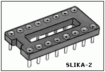

## Integrisano Stereo Pojačalo

*Samogradnja* **audio pojačala** je najčešće, i od strane većine onih koje zanima audio tehnika, smatrana za previše težak i verovatno neisplativ poduhvat. Uz to, odavno je duboko usađeno uverenje da ništa što je "pravljeno" ne može da valja niti da bude makar i blizu fabričkog.

Ni jedna od tih tvrdnji nije tačna, a da je to tako, pokušaćemo da dokažemo ovim uslovno rečeno, *"uvodnim"* projektom na kraju koga ćete uz užitak i ponos da ste to sami napravili, moći da se pohvalite i sa dosta novostečenog znanja, a što je najvažnije... dobićete jedno sasvim kvalitetno kućno stereo pojačalo koje će po svojim karakteristikama dosta lako nadmašiti većinu fabričkih MINI i MIDI linija!

> Smatram da je fer i korektno da sve one koji razmišljaju da se upuste u ovakav poduhvat, na samom početku upozorim na nekoliko stvari:

- Iako sam na početku rekao da samogradnja nije previše teška, ipak je ne bi baš trebalo shvatiti kao dva-tri lagana popodneva sa lemilicom u ruci i na kraju je sve odmah i "od prve" u redu! Oni koji do sada nikada nisu ništa slično napravili moraće ili da dosta toga u hodu sami nauče ili bi valjalo da u toku rada obezbede da uz sebe makar povremeno imaju nekoga ko je iskusniji.
- Nemojte očekivati da se jedan ovakav uređaj može kompletno uraditi za 50-70 Eura. Samogradnja najčešće nije jeftinija od gotovog fabričkog uređaja, ali za razliku od fabričkog uređaja ona sobom donosi neprocenjivu dodatnu vrednost... znanje, iskustvo i neizmerno zadovoljstvo činjenicom da je delo vaših ruku i znanja! E to nema cenu... naravno, ako vam to nešto znači! Imajte na umu da će ukupni troškovi u mnogome zavisiti i od vaše snalažljivosti kao i cilja koji ste u startu pred sebe postavili. Veliki deo opšteg utiska završenog projekta zavisiće od njegovog spoljnjeg izgleda odnosno estetike. Sve se može upakovati u neku lepu namenski urađenu kutiju koja obično nije jeftina, ali se uz malo mašte i veštine toj nameni izvanredno mogu prilagoditi kućišta nekog starijeg neispravnog pojačala ili tjunera, ali i kućišta nekih starijih desktop računara. Isti pristup se odnosi i na neke druge delove projekta kao što su hladnjaci, transformator, dugmad za potenciometre itd. itd. Sve te nabrojane komponente čine ujedno i najveći finansijski izdatak kod većine samogradnji.
- Ulazeći u ovaj projekat, pošao sam od pretpostavke da svi oni koji se budu prihvatili ovakve samogradnje, već poseduju neka osnovna predznanja iz elektrotehnike i savladane makar osnovne praktične veštine vezane za samogradnju. Tu podrazumevam sledeće: da zna da prepozna i odredi vrednosti komponenata, da ume da se vizuelno snalazi i orjentiše na pločici uz pomoć nacrta rasporeda komponenata, da ima savladane barem osnovne veštine rukovanja sa lemilicom i procesa lemljenja komponenata te da su mu poznate i da je svestan mogućih opasnosti koje sa sobom nosi izrada i rukovanje uređajem koji se napaja iz gradske mreže, budući da postoji velika verovatnoća da tokom izrade, podešavanja i korišćenja može doći u dodir sa komponentama koje su pod naponima opasnim po život!!!

Da bi se *obezbedilo* da većini zainteresovanih čitalaca projekat bude što lakši za izradu, vodio sam računa da u njemu budu korišćene lako nabavljive i relativno jeftine komponente a da se pri tom ne žrtvuje kvalitet i pouzdanost. Koliko je u mom znanju, sve komponente bi trebalo da su nabavljive kod domaćih snabdevača, mada verovatno ne baš sve kod jednog istog snabdevača.

Takođe sam se trudio da vodim računa i o konstrukcionoj fleksibilnosti uređaja. Zato je dizajn zamišljen tako da dozvoljava mnoge kasnije eventualne izmene, prepravke ili poboljšanja kao i prilagođavanje ličnim potrebama graditelja. Neki podsklopovi se mogu u potpunosti izostaviti ili premostiti i tako isključiti iz funkcije, promenama nekih komponenti se uređaj može prilagoditi ostatku postojećeg sistema, čak se pri dizajnu pločice išlo dotle da je predviđena mogućnost da se delovi pločice iseku i koriste kao odvojeni moduli!

### Kako to radi?

*U osnovi*, ovaj deo audio lanca se kod gotovo svih uređaja te vrste sastoji iz dva osnovna podsklopa: pretpojačala i izlaznog pojačala snage. Oni mogu biti urađeni kao dva potpuno zasebna uređaja u zasebnim kutijama ali i kao jedan integrisani sistem kao što je to slučaj sa HF2006. Pod pojmom "integrisani sistem" ili "integrisano pojačalo" u audio tehnici se podrazumeva da su pretpojačalo i izlazno pojačalo ugrađeni u jednu kutiju kao jedan uređaj i taj izraz ne treba mešati sa pojmom integralnih kola. I jedan i drugi sklop istina mogu biti u celosti izvedeni uz pomoć integralnih kola ali njihov naziv "integrisano" ne potiče iz tog razloga.

U svom osnovnom obliku, pretpojačalo služi da relativno slabe signale iz nekog izvora (to može biti CD-plejer ili Tjuner ili cassete-deck ali i zvučna kartica PC-a) podigne na znatno viši nivo, odnosno da ih naponski pojača. Današnji moderni izvori signala uglavnom već imaju prilično visok nivo izlaznog signala, pa u nekim slučajevima pretpojačalo gotovo da nije ni potrebno. Međutim, podizanje nivoa signala nije jedini zadatak pretpojačala. Druga važna funkcija je korekcija "boje tona" koja je od strane izvesnog manjeg broja audio "čistunaca" danas žestoko napadana i odbačena kao štetna i nepotrebna. Autor ovog projekta se sa takvim misljenjem apsolutno ne slaže, ali je imajući u vidu vrlo širok dijapazon ljudi koji bi mogli biti potencijalni graditelji ovog projekta, predvideo i mogućnost da se u pretpojačavačkom delu HF2006 celokupan sklop za kontrolu boje tona premosti ili u potpunosti izbaci, u koliko to nekome bude želja. Oni koji taj deo šeme zadrže i izvedu mogućnost da kontrolu boje tona po želji uključe ili isključe moći će se lako uveriti ko je tu u pravu.

Primetićete da se u celom pretpojačavačkom lancu koristi ista vrsta operacionog pojačavača (OP u daljem tekstu) NE5534AN koji je odabran iz više razloga. Ovaj OP je za naše uslove upravo idealan kompromis jer je veoma lako nabavljiv, relativno je vrlo jeftin a ima izvanredne osobine za audio namene. Treba svakako reći da on nije poslednja reč tehnike i da danas ima daleko, daleko boljih OP ali su svi oni i mnogo skuplji i mnogo teže nabavljivi, a kada sve zajedno sagledate i uzmete u obzir (namenu ovog dizajna, početni nivo projekta itd. itd.) tada biva jasno da je NE5534AN još uvek daleko najbolji kompromis. Ovaj OP je sposoban da proizvede 10V RMS na izlaznom opterećenju od 600 oma, ulazni šum je oko 3,5nV/Hz a SlewRate doseže 13V/uS kod nekompenzovanog spoja i 6V/uS kod korišćenja frekvencijske kompenzacije. Inače, frekvencijska kompenzacija je potrebna samo ako će OP raditi sa pojačanjem manjim od 3. Da neko ne bi bio u zabludi ili razočaran jer se ne koriste najbolji OP koji se trenutno mogu naći, treba da kažemo da su još do pre nekoliko godina većina vrlo kvalitetnih CD plejera kao i mnogi profi sistemi za snimanja u studijima masovno koristili NE5534 seriju integralaca!

Na samom ulazu se nalazi sklop poznat kao RIAA korektor (IC1) i on se koristi samo za signale iz gramofona sa dinamičkom "glavom" tj. "pickup"-om. Dinamički pickup ima vrlo mali nivo signala reda nekoliko milivolta do nekoliko desetina milivolta tako da ga treba dosta pojačati da bi se izjednačio sa ostalim izvorima signala. Uz to, zbog prihvaćenog standarda (RIAA/IEC) frekvencijske karakteristike prilikom snimanja gramofonskih ploča koja ima jako potisnute niske a izdignute visoke frekvence, potrebno je prilikom reprodukcije sa gramofonske ploče takvu karakteristiku modifikovati sklopom čija je frekvencijska karakteristika upravo suprotna, tj. sa izraženim niskim a potisnutim visokim frekvencama da bi se na kraju ponovo dobio originalni frekvencijski spektar signala. Tačni iznosi izdizanja i potiskivanja su dosta precizno određeni tim opšteprihvaćenim standardom, ali su za vašu prvu gradnju potpuno nevažan podatak pa smatramo da nema potrebe to dalje elaborirati. Ako u svom sistemu nemate takav izvor signala (gramofon) niti planirate da ga imate, nema potrebe da u toku izrade uređaja nabavljate komponente za taj deo šeme niti da to sastavljate.

Ostali izvori signala uglavnom imaju dosta više nivoe pa ih je potrebno mnogo manje pojačati a ne treba im ni bilo kakva predefinisana frekvencijska korekcija. Svi se oni preko potenciometra za regulaciju jačine zvuka (VOLUME) dovode na ulaz jednog linearnog pojačavačkog stepena (IC2) čije je pojačanje određeno odnosom otpornika u povratnoj sprezi (R11 i R12) i u ovom slučaju iznosi oko 5x. Ako postoji potreba i ta vrednost pojačanja se naknadno može korigovati upravo promenom vrednosti tih otpornika, ali savetujem da se pojačanje ne spušta ispod 4x iz razloga potrebe za frekvencijskom kompenzacijom o čemu je govoreno u prethodnim pasusima. Pojačanje će biti veće ako podižete vrednost R11 ili smanjujete vrednost R12 i obrnuto, pojačanje se smanjuje sa smanjenjem R11 ili povećanjem R12. Bolje je da za potrebe promene pojačanja menjate vrednost R12 a da uopšte ne dirate R11! Sa izlaza ovog stepena se pojačani signal vodi na stepen sa aktivnom kontrolom "boje" tona (IC3). Sama kontrolna mreža je deo povratne sprege tog OP ali je tako koncipirana da je njegovo pojačanje 1x kada su klizači oba potenciometra za duboke i visoke tonove (BASS i TREBLE) tačno na sredini. To znači da će signal koji uđe u ovaj stepen, izaći potpuno isti tj. nepromenjen što se tiče frekvencijskog sadržaja i naponskog nivoa. U svim drugim položajima tih potenciometara, ravnoteža skopa će biti više ili manje poremećena te mu pojačanje neće ostati 1x već će biti ili veće ili manje od toga a uz to, taj poremećaj pojačanja neće biti ravnomeran za sve frekvence. To je postignuto korišćenjem kondenzatora kao delova mreže za kontrolu a kao što znate, kondenzatori ne predstavljaju istu otpornost za naizmeničnu struju na svim frekvencama. Da bi tonska kontrola kvalitetno obavila svoj posao, ne sme se preterati sa time u kojoj meri će ona moći neke frekvence da izdigne ili oslabi. Zbog toga su tonske kontrole u ovom dizajnu ograničene na najviše 10dB kako u izdizanju tako i u potiskivanju i dubokih i visokih tonova. Izlaz iz ovog stepena se vodi na potenciometar za kontrolu balansa koji je dodatkom otpornika R19 u nekoliko poboljšan jer sa njim postoji u srednjem položaju BALANCE potenciometra P4 gubitak signala od "samo" 3,3dB umesto celih 6dB kada tog otpornika ne bi bilo.

Pojačavač snage ili "izlazni stepen" kako se često naziva, je takođe izveden sa integralnim kolom i ta je uloga u ovom dizajnu poverena kolu TDA 7294V. Šema izlaznog stepena je data na slici2. Kolo je sposobno da na opterećenju od 8 oma proizvede punih 50...60W snage i to veoma visokog kvaliteta. Može ono da pruži i više ali uz povećana izobličenja i rizike od dodatnih problema. Nemojte potceniti 50W snage... to je više nego dovoljno za većinu normalnih kućnih potreba, i to je PRAVIH 50W koji će zvučati kvalitetnije i snažnije od onih mini- linija sa 2x1200W ili 2x1800W PMPO. Uz sve kvalitete vezane za zvuk, kolo ima još nekoliko veoma korisnih osobina. Ima ugrađenu zaštitu od preopterećenja i pregrevanja i samo će se privremeno isključiti (bez oštećenja!) ako se zagreje preko 145 stepeni. Poseduje i ugrađen sklop za eliminisanje naponskog "udara" u zvučniku u momentu uključenja. Takav udar je za slušaoca prilično neprijatan a može biti i vrlo štetan za zvučnike.

U osnovi, svaki takav snažan audio integralac možete posmatrati funkcionalno kao jedan klasičan operacioni pojačavač samo takav koji je sposoban da radi na dosta višem naponu napajanja i koji je sposoban da na opterećenju proizvede mnogo više snage. Kao i svaki OP i on ima dva ulaza: "neinvertujući" na nožici 3 i "invertujući" na nožici 2 i izlaz na nožici 14. Pojačanje mu je definisano odnosom otpornika 10k i 330oma u povratnoj sprezi koja u vidu razdelnika napona vraća oslabljeni deo signala sa izlaza (pin 14) na "invertujući" ulaz (pin 2). Sa datim vrednostima pojačanje je oko 30x. Ako se pokaže potreba, ta se vrednost može takođe menjati promenom vrednosti otpornika od 330 oma. U koliko tu vrednost smanjujete pojačanje će rasti i obrnuto, u koliko povećavate otpornost otpornika na tom mestu pojačanje će opadati. Važno je napomenuti da ovo integralno kolo mora da radi sa faktorom pojačanja od najmanje 16x (tj. oko 24dB) da bi radilo stabilno, pa ako se odlučujete da se "igrate" sa promenom pojačanja izlaznog stepena, nemojte odabrati takve vrednosti ovih otpornika da pojačanje bude manje od 16x. Za sigurnost, u praksi ne bi trebalo ići na pojačanje manje od 20x.

Napajanje oba izlazna stepena je zajedničko i izvedeno je sasvim klasično. Nije korišćena nikakva stabilizacija jer smatram da za ovakav "uvodni" tj. početni dizajn nije neophodna, ali se svakome ostavlja mogućnost da to kasnije dogradi kao interesantno poboljšanje. Korišćeni transformator je toroidnog tipa i ima jedan bifilarno motani sekundar od 2x24V/4A, i jedan manji takodje bifilarno namotan sekundar od 2x15V/200-250mA. Sa takvim naponima sekundara i uz punotalasno mostno ispravljanje dobiće se na glavnim elektrolitskim kondenzatorima (po 3x4700uF u svakoj grani napajanja) jednosmerni napon od oko +/- 35V. To je optimalan napon napajanja za ovo kolo da se obezbedi zadovoljavajuća snaga a da se pri tom ne ide do granica njegovih mogućnosti a time i rizika od pregorevanja i otkaza. Kolo može da radi i na +/- 40V i tada daje čak i nešto više snage, ali je to maksimalan napon koji se sme na njega dovesti i u principu se za kvalitetan i pouzdan rad sklopa ne preporučuje.

### A kako sada sve to sklopiti?

Da bi vam što više *olakšao* proces izrade, dizajnirana je pločica na kojoj se nalaze i kompletno stereo pretpojačalo i stereo pojačalo kao i napajanja za oba dela sistema. Pretpostavljam da oni koji se upuštaju u ovakvu gradnju znaju da prepoznaju i "čitaju" komponente i njihove vrednosti. U koliko to još niste savladali, savetujem da to svakako učinite pre početka gradnje jer su u protivnom greške, problemi i razočarenje skoro sigurni, a velike su šanse da i vaši troškovi budu mnogo veći nego sto je neophodno.

Proces sklapanja započnite od detaljnog razgledanja same pločice i crteža na kome je dat raspored elemenata na njoj da bi stekli što bolju orijentaciju gde se šta nalazi jer će vam tako sam proces sklapanja ići i brže i lakše. U suštini, ne postoji nikakvo kruto pravilo kako i kojim redom se sastavlja jedan uređaj i tok tog procesa uglavnom zavisi od vašeg iskustva, znanja i veštine.

> Ipak, ako ste manje iskusni ili vam je ovo možda čak i prvi ovakav poduhvat, savetujemo da se držite sledećeg redosleda rada:

- Prvo postavite i zalemite sve žičane kratkospojnike kojih na pločici ima 15. Za to se najčešće koriste odsečeni izvodi otpornika ali se može koristiti bilo koja puna bakarna žica promera 0,7- 1mm.
- Postavite i žicu koja je na rasporedu označena ljubičastom bojom. Ona treba da je licnasta sa PVC izolacijom i površine preseka provodnika od barem 1,5mm2. Ona dovodi pozitivan napon na desni izlazni stepen i ne sme se zaboraviti! Nemojte je odseći na najmanju moguću dužinu tako da najkraćim putem ide od jedne do druge tačke jer vam se kasnije može naći na putu nekog od elemenata koji ćete lemiti, pa ga nećete moći staviti na njegovo mesto jer vam ta žica smeta.
- Za sada NEMOJTE postavljati glavne dovode napajanja a to su crvena i plava žica. To ćete učiniti kasnije pre samog uključenja i testiranja.
- Sledeći korak je popunjavanje pločice pasivnim elementima. To su otpornici, blok kondenzatori, elektrolitski kondenzatori, i razne mehaničke komponente ako ih ima, kao što su podnožja za integralna kola, razni kontakti i konektori itd.
- Počnite sa postavljanjem otpornika. U koliko ste nabavili komponente po specifikaciji, onda su otpornici koje ste uzeli označeni sa 5 prstenova u bojama i da bi se lakše snašli da pročitate njihovu vrednost, pripremio sam vam i kolor-tabelu na kraju članka uz specifikaciju materijala. Da bi bili sasvim sigurni, nije na odmet da svaki otpornik pre ugradnje izmerite i vašim digitalnim univerzalnim instrumentom. To jeste mukotrpnije i dugotrajnije ali je barem mogućnost greške jako smanjena što je kod prvih gradnji najvažnije. Otpornici nemaju definisan polaritet pa je nebitno kako ste ih okrenuli i zalemili. Postavite ih tako da leže na pločici i dodiruju je svojom površinom. Na taj način će njihovi izvodi biti najkraći što je bitno zbog stabilnosti uređaja u radu.
- Sada nastavite sa postavljanjem blok kondenzatora koji takođe nisu polarisani pa je nebitno kako ste ih okrenuli. Trudite se da i njihovi izvodi budu što kraći.
- Elektrolitski kondenzatori se delimično razlikuju od prethodnih komponenata po tome što imaju određen polaritet što znači da NIJE SVEJEDNO kako ste ih postavili. Ako tu pogrešite može doći do trajnog oštećenja tih elemenata i do problema sa radom uređaja. Pogrešno postavljanje velikih elektrolita koji rade na višim naponima može izazvati i njihovo eksplodiranje kod prvog uključenja i može vam naneti telesne povrede!!! Na crtežu rasporeda elemenata je kod svakog elektrolita označena "plus" nožica, a na stvarnim elektrolitima je na plastičnom omotaču najčešće označena "minus" nožica pa pretpostavljam da će svakome biti logično kako da okrene i postavi elektrolite.
- Mada to u audio elektronici nije baš poželjna praksa, ipak vas kod vaše prve samogradnje savetujemo da za integralna kola u pretpojacalu koristite podnožja tj. da ih ne lemite direktno na pločicu. Kada već moraju da budu podnožja onda barem neka budu što kvalitetnija, pa vas savetujemo da nabavite takozvana niskoprofilna "precizna" tj. "mašinski urađena" podnožja sa pozlaćenim kontaktima, dakle NE ONA čiji su kontakti urađeni sa elastičnim percima. Izgled jednog "preciznog" podnožja je dat na slici-2. Postavite podnožja na njihova mesta pazeći da ih tačno okrenete a za to će vam pomoći oznake za nožicu broj 1 koje su na rasporedu elemenata označene kao crvene tačke na integralnim kolima NE5534AN. Kada postavite sva podnožja **NEMOJTE ZA SADA** u njih *stavljati* integralna kola!!!

  
  

 

- Izlazni integralci TDA7294 nemaju podnožja i leme se direktno na pločicu. Kako da njih pravilno okrenete i postavite, vidi se na crtežu rasporeda elemenata na kome se jasno vidi oznaka za nožicu broj 1 koja je na samom kolu prva sa leve strane kako je to dato na slici-3.
- Sada postavite i zalemite (opet pazeći na polaritet!!!) mostne ispravljače tj. "grečeve" kako su još poznati. To ne bi trebalo da bude teško jer se na njihovim kućištima već nalaze fabrički odštampane oznake izvoda baš kao što su na crtežu rasporeda elemenata.
- Pre prvog uključenja je ostalo još samo da postavite dva mala integralna kola stabilizatore napona 78L15 za +15V i 79L15 za -15V. Oni su u malom plastičnom kućištu koje ima jednu ravnu stranu i nju treba okrenuti baš tako kako je na crtežu rasporeda.
- **P A Ž N J A** - Postoji mala *greška* na pločici - treba ukloniti vodove koji kratko spajaju tačke A i A* kao i tačke B i B* koje idu na ulazne preklopnike! Oni se ne vide na rasporedu ali greškom postoje na samoj pločici.

Ovime je završena prva faza sklapanja vašeg novog pojačala. Neke delove namerno za sada nismo postavili na njihova mesta jer je prvo potrebno da proverimo ispravan rad sklopova za napajanje. Sada je vreme da izvode sa sekundara mrežnog transformatora povežemo sa pločicom onako kako je to dato na crtežu rasporeda elemenata. Kada naručujete transformator, zamolite da vam jasno označe izvodne žice da kasnije ne bi imali problema da pronađete koja je koja. Ako ste se striktno držali predloženog toka sklapanja to znači da se na vasoj pločici ne nalazi ni jedan NE5534AN postavljen u podnožje u pretpojačalu a takođe nema ni dva glavna voda (crveni i plavi) za napajanje izlaznih stepena. U koliko ste pločicu popunjavali po sopstvenom nahođenju i redosledu, pa ste malopre pomenute elemente već postavili, savetujemo da ih privremeno uklonite. Sledi prvo uključenje a u tom momemtu još uvek ne znate da li je sve sa naponima OK, pa bi moglo da dođe do oštećenja ili uništenja nekih komponenata ako naponi nisu kako treba.

> U sledećim fazama rada već dolazite u dodir sa komponentama koje su u vezi sa naponom gradske mreže koji može biti opasan po život, pa zato u svakom momentu budite veoma oprezni i pažljivi!!! Brzopletost i nemarnost u tim slučajevima može imati previsoku cenu!

Uključite transformator u 220V i izmerite napone na izlazima sklopova za napajanje. Na crtežu rasporeda elemenata pronađite dva žičana kratkospojnika označena kao"LINK" i to jedan dat crvenom bojom a drugi plavom. Postavite svoj univerzalni instrument (u daljem tekstu ćemo ga zvati skraćeno "UNI" ) na položaj za jednosmerni napon i opseg merenja oko 20-50V . Izmerite da se u odnosu na masu ( GND ) na crvenom LINK-u nalazi +15V a na plavom -15V. Moguće je da ovi naponi malo odstupaju zbog tolerancija u proizvodnji komponenata, ali to ne bi trebalo da je više od 0,1V u bilo koju stranu. Ako su odstupanja drastično veća, proverite šta nije u redu i ispravite grešku ili problem. Sada prebacite preklopnik na vašem UNI tako da može da meri napone više od 40V i takođe proverite ispravljač visokog napona za izlazne stepene. Ako ste nabavili tranformator sa naponom sekundara od 24V neopterećeno, trebalo bi da na glavnim elektrolitskim kondenzatorima u ovom ispravljaču izmerite po 35V jednosmernog napona u svakoj grani napajanja. Dakle na mestu gde treba da izlazi crvena žica treba da izmerite +35V a na mestu plave žice -35V u odnosu na masu. Ta dva napona se mogu više razlikovati nego prethodni od 15V budući da napajanje za izlazne stepene nije stabilisano i zavisiće u mnogo većoj meri od trenutnog napona u gradskoj mreži koji od slučaja do slučaja može značajno da se razlikuje od nominalnih 220V AC. Dakle, nemojte se začuditi ako izmerite 34V ili čak i 33V ali isto tako može biti i 36V pa i 37V. Mnogo je bitnije da je razlika između pozitivne i negativne grane što manja. Ako su vam svi mereni naponi u očekivanim granicama, isključite napajanje iz mreže i sačekajte da se elektroliti polako isprazne ili im "pomozite" nekim većim otpornikom ali NE direktnim kratkim spojem. Tek kada proverite da su glavni veliki elektroliti ispražnjeni, zalemite "crvenu" i "plavu" žicu prema crtežu rasporeda elemenata. Ove dve žice treba da su licnaste, sa PVC izolacijom i poprečnog preseka od barem 2mm^2 a poželjno je i malo više.

Sledeći korak je testiranje izlaznih stepena. Da bi to sproveli, neophodno je da sada montirate hladnjak (ili hladnjake ako ste se odlučili za odvojene za svaki stepen) jer nije preporučljivo uključivati ova integralna kola na napajanje ČAK NI NA SEKUND ako im nije obezbeđeno hlađenje! Miodrag je koristio hladnjak od starog INTEL Pentium II procesora sa ventilatorom. Iako je to na šemi jasno naznačeno, ponovo napominjemo da se kod montaže na hladnjak obrati pažnja na činjenicu da se masivna metalna pločica koja čini zadnju površinu TDA kola nalazi unutar kola vezana električki na nožicu broj 15 tj. na negativnu granu napajanja, pa se u radu ta pločica praktično nalazi na potencijalu od -35V. Zbog toga je neophodno da se prilikom montaže oba TDA kola na hladnjak koristi termička podloška koja će pomoći da se toplota sa integralca što bolje prenese na hladnjak a u isto vreme će električki odvojiti pločice na integralcima koje su na -35V od hladnjaka koji je obično zašrafljen na šasiju koja je uzemljena tj. na potencijalu 0V. Kada završite montažu TDA kola na hladnjak, obavezno uzmite UNI, postavite ga da meri otpor ili na položaj za merenje dioda (na modernijim digitalnim UNI) i proverite da nema kratkog spoja između hladnjaka i metalnih plocica na TDA kolima! NEMOJTE PRESKOČITI OVU PROVERU!!! Postoji i drugačije rešenje a to je da se svako TDA kolo montira na zaseban hladnjak koji je potrebno električki izolovati od mase i svega drugog. Tada vam ne treba nikakva podloška već je potrebno samo na dodirnu površinu integralca naneti tanak sloj takozvane "silikonske termičke paste" kao pomoć za bolje odvođenje toplote, i direktno ga pričvrstiti na hladnjak. Tada će i odvođenje toplote biti nešto efikasnije. Nije na odmet da po pitanju hladnjaka (koji su inače relativno skupi i teže nabavljivi kao elementi) razmišljate i o "cooler"-ima za malo starije mikroprocesore u računarima. Dobar deo njih ima dimenzije oko 60x60mm u osnovi kao i dosta gusto urađena rebra pa uz gotovo bezšumni ventilator koji je već fabrički montiran, pretstavljaju veoma efikasno, lako nabavljivo i relativno jeftino rešenje. Ako vam se čini da je buka koju pri radu pravi inače dosta tih ventilator, ipak veća od onoga što ste želeli, vrlo je jednostavno smanjiti mu rednim otpornikom napon kojim se napaja što će istina malo smanjiti hlađenje ali i eliminisati buku tj. šum koji pravi. Tu buku ili šum će te moći da čujete samo u baš sasvim tihoj prostoriji i pri veoma tihom slušanju muzike, dok će biti vrlo teško da se primeti već pri osrednjim nivoima snage. Konačna odluka po pitanju hladnjaka je ipak na vama i vašim željama i prohtevima. Ove ventilatore možete napajati bilo sa elektrolita u sklopu napajanja pretpojačala bilo sa glavnih elektrolita u napajanju za izlazne stepene. U oba slučaja je napon na tim tačkama dosta viši nego što vam za ventilatore treba pa ćete ili koristiti malo snažnije redne otpornike čije ćete vrednosti morati sami da odredite eksperimentom jer će zavisiti od upotrebljenih ventilatora, ili ćete na dodatnoj maloj pločici "raster" tipa, napraviti jednostavan stabilizator sa nekim promenjljivim regulatorom kao što je LM317.

Ako je sve u redu sa montažom izlaznih integralaca možete preći na sledeći korak. Postavite privremeno kratak spoj na ulaze oba izlazna stepena (označeni su sa "IN") a na zvučničke izlaze za sada ne priključujte ništa. Ponovo uzmite UNI, podesite ga na merenje jednosmernog napona i to na nekom nižem opsegu reda 200...500mV i priključite ga na zvučnički izlaz jednog od izlaznih stepena. Sada uključite napajanje i proverite da instrument ne pokazuje više od nekoliko desetina mV bilo u plus ili u minus. Ne menjajući ništa, proverite da je isto ili slično stanje i na izlazu drugog kanala. Ako bilo šta od ovoga sto smo rekli nije tako u vašem slučaju, momentalno isključite napajanje i tražite gde je problem! Poželjno je da taj "mirni" izlazni napon za koji ćete često naći da ga nazivaju i "simetrija" , bude što manji tj. što bliže nuli, ali je u praksi sasvim prihvatljivo da se tu nalazi napon od 20..30... pa čak i do 50mV ali svakako ne bi valjalo da je više od toga! Taj poremećaj simetrije najčešće potiče od nejednakih napona u glavnim granama napajanja i tu se malo toga može uraditi ako vam transformator nije tačno namotan! Ako je pak sve u granicama očekivanog možete isključiti napajanje i ukloniti kratki spoj na ulazima.

Sada je vreme da se povežu potenciometri za jačinu, boju tona i balans. Predviđeno je da se u tu svrhu na strani pločice koriste tropolni muško/ženski konektori, ali ako vam se to ne dopada, možete da sve to povežete i direktnim lemljenjem. Pratite pažljivo crtež rasporeda elemenata i po završenom povezivanju još jednom sve detaljno proverite. Ako ste se odlučili da vam trebaju svi stepeni pretpojačala, dakle i RIAA korektor, sada postavite u podnožja svih 6 komada NE5534AN a ako nemate RIAA stepen onda samo 4 komada. Vrlo pazite kako okrećete ta integralna kola, jer kod tog tipa komponenata to NIJE svejedno! Kod svih integralaca tog tipa je nožica broj 1 označena jednim izdubljenim kružićem na gornjoj strani kućišta što je prikazano na slici-4. Kola treba postaviti tako da im se položaj tih kružića poklapa sa položajem crvenih tačaka na crtežu rasporeda. Sada odmerite dovoljne dužine i napravite dva kratka komada tanjeg oklopljenog "mikrofonskog" kabla sa konektorima na oba kraja. Na crtežu rasporeda elemenata pronađite cetiri dvopolna konektora: dva se nalaze kod izlaznih stepena i označeni su sa "IN" i to su ulazi izlaznih stepena, a druga dva se nalaze u pretpojačalima blizu ispravljačkog stepena i označeni su sa "OUT" i to su izlazi iz levog i desnog kanala pretpojačala. Iz jednog "OUT" konektora idete napravljenim kablićem u jedan od "IN" konektora a iz drugog "OUT" konektora u drugi "IN" i na taj način ste povezali levi i desni kanal pretpojačala sa njihovim odgovarajućim izlaznim stepenima. Za potrebe prvog uključenja, kao ulaz u pretpojačalo ćemo koristiti tačke označene sa "A" i "B" a ne ulazne konektore "IN" na pretpojačalima!



Stigli smo i do "trenutka istine" tj. do prvog uključenja celog uređaja. Pre tog momenta, potrebno je još jedino da na izlaze pojačala priključimo zvučnike, da na ulaz pretpojačala (privremeno su to tačke "A" i "B") dovedemo audio signal iz nekog kvalitetnog izvora (recimo CD-plejer) i da potenciometre postavimo u početni položaj. Za tu svrhu treba VOLUME (jačinu tona) postaviti na "nulu" tj. okrenuti ga sasvim do kraja u levu stranu a sve ostale potenciometre, za BASS, TREBLE i BALANCE na srednji položaj.

Uključite napajanje i trebalo bi da u tim prvim momentima ne čujete baš NIŠTA iz zvučnika. Dakle, trebalo bi da nema ni onog karakterističnog prvog impulsa tj. "udara" iz zvučnika, a ne bi trebalo da se čuje ni bilo kakvo brujanje niti šum izuzev možda jako slab, jedva čujan šum kada uho prislonite do samog visokotonskog zvučnika. Bilo šta da se događa drugačije od ovoga što smo opisali, znak je da nešto nije u redu i da treba momentalno da isključite uređaj. Ako se uređaj ponaša kako smo opisali, startujte muziku na CD-plejeru (ili nekom drugom izvoru signala koji u tom momentu koristite za test) i polako okrećite potenciometar za jačinu tona u desno dok se iz zvučnika ne začuje muzika. Slušajući pažljivo da nema kakvih izobličenja, nastavite sa okretanjem potenciometra sve negde do polovine njegovog hoda. Trebalo bi da je već više nego dovoljno glasno i da pri tom nema nikakvih tragova izobličenja koje "na uho" možete da konstatujete. Posle nekoliko minuta rada pri toj snazi, proverite kako stoje stvari sa temperaturom hladnjaka izlaznih integralaca. Oni bi trebalo da su gotovo hladni ili samo vrlo blago topli za to vreme. Pustite pojačalo neka tako radi 10-tak minuta i za to vreme možete da proverite funkcionisanje ostalih potenciometara, a povremeno i dalje kontrolišite temperaturu hladnjaka. I posle 10 minuta rada pri toj snazi, hladnjak ili hladnjaci ne bi smeli biti toliko topli da na njima ne možete da stalno držite ruku bez potrebe da je sklonite. Svakako, to važi samo u slučaju ako ste uzeli odgovarajuće tj. dovoljno velike hladnjake. Ako se oba TDA nalaze na zajedničkom hladnjaku, on ne bi trebalo da ima temperaturni koeficijent veći od 0,5K/W a ako svaki TDA ima zaseban hladnjak, oni bi trebalo da su za oko 1K/W. To važi za hladnjake bez forsiranog hlađenja tj. bez ventilatora. Uz forsirano hlađenje, hladnjaci mogu biti nešto manjih dimenzija tj. većeg temperaturnog koeficijenta. Za praksu za ubuduće zapamtite jedno grubo pravilo: temperatura hladnjaka se testira nadlanicom šake a ne dlanom jer je koža na nadlanici tanja i osetljivija, i dokle god možete da na hladnjaku držite ruku njegova temperatura nije veća od oko 50...55 stepeni što vrlo lako i bez rizika podnosi sva današnja elektronika i smatra se sasvim normalnom radnom temperaturom za silicijumske poluprovodnike! To ne znači da temperatura ne sme biti viša od toga i da će se nešto loše desiti ako poraste iznad tih 55 stepeni. Ima puno vrhunskih pojačala koja rade u takozvanoj "klasi A" kod kojih hladnjaci normalno dostižu 80...90 pa i 100 stepeni u radu, ali su to već "igre na granici" i tome ne treba težiti.

Ako ste došli do ove tačke i sve se ponaša normalno i u skladu sa opisom koji sam dao, Vaš uredjaj je potpuno gotov i spreman za rad!

Prvi primerak-prototip ovog dizajna napravio je Gdin Miodrag Lutovac iz Berana (CG) i to izuzetno uredno i lepo što i nije čudno znajući njegovo iskustvo i veštinu. Uredjaj je najnormalnije proradio već na prvom uključenju. Tako će se ponašati i svaki drugi sklopljen primerak ako su korišćene ispravne i originalne komponente i ako tokom gradnje nije napravljena nekakva greška u postavljanju komponenata ili lemljenju ili povezivanju. Evo i slika tog prototipa...

<link rel="stylesheet" href="https://ronovar.github.io/bas.github.io/css/photoswipe.css">

